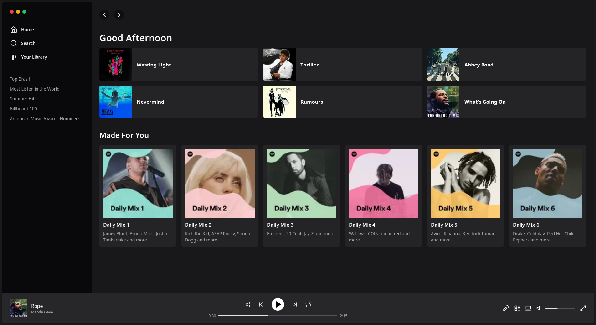

<h1 align="center"> Spotify UI Clone </h1>

<p align="center">
  
  
  
  
  
  
  
</p>

<p align="center">
  <a href="#-technologies">Technologies</a>&nbsp;&nbsp;&nbsp;|&nbsp;&nbsp;&nbsp;
  <a href="#-project">Project</a>&nbsp;&nbsp;&nbsp;|&nbsp;&nbsp;&nbsp;
  <a href="#-layout">Layout</a>&nbsp;&nbsp;&nbsp;|&nbsp;&nbsp;&nbsp;
  <a href="#memo-license">License</a>
</p>

<p align="center">
  
</p>

<br>

<p align="center">
  
</p>

## 🚀 Technologies

This project was developed with the following technologies:

- React
- Next.js
- TypeScript
- Tailwind CSS
- Lucide Icons
- Git e Github

## 💻 Project

This repository hosts an application that replicates the Spotify interface, built using React, Next.js and TypeScript. The project is designed to showcase my skills in web development and UI design. It serves as a personal project to practice and demonstrate my abilities in creating responsive and visually appealing web applications.

## 💻 How to run

```bash
# Clone the repository
git clone https://github.com/filipebteixeira98/spotify-ui-clone.git

# Access the project folder
cd spotify-ui-clone

# Install the dependencies
pnpm install

# Run the project
pnpm dev
# The project will be available at http://localhost:3000
```

## 📝 License

This project is under the MIT license.

<p align="center">
  Made with ♥ by me
</p>
